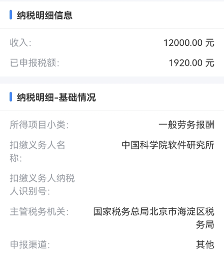
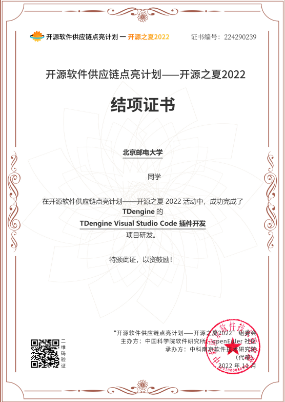
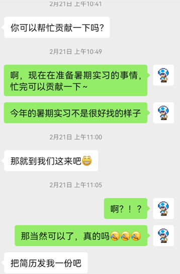

# 开源之夏活动推荐（我从开源之夏收获了什么）

笔者是开源之夏2022年开源之夏结项，开源之夏第一位校园大使，在这个活动中收获良多。在这里记录一下自己的收获，可不只是12000块钱那么简单哦。

## 适合参加开源之夏的同学

开源之夏总体还是一个有难度的活动，在安利开源之夏前，需要同学们根据下面的标准简单衡量一下自己是否适合这个活动。

这样的同学非常适合参加开源之夏“
  - 有一定的代码基础，并熟悉对应语言的一些常用框架及包管理工具
  - 擅长利用问答社区（CSDN、StackOverflow）、搜索引擎或 chatGPT 解决自己的问题
  - 非常希望可以做一些别人没有做过的事情，这很酷

这样的同学最好不要参加开源之夏：

  - 0基础的代码小白，希望通过这个活动学会代码
  - 希望导师会手把手的教学（类似直接安装环境或者现场 debug）
  - 写一段代码前，最好先是看到有人已经能写出来了“抄作业”

以上是笔者的主观判断。这还是一件很难的事情，笔者担心有同学会听完安利后鼻青脸肿的回来抱怨。

## 收获1：丰厚的奖金和证书

支付方为“中国科学院软件研究所”的奖金还是很让人开心的。（这个扣税在年底是可以退回的，到账时间要到年底，请耐心等待）

我的证书（2022是很惨的一个电子版，不知道后面会不会有实体的，咱给组委会提过建议了2333）

## 收获2：社区的认可

做完的项目后续有一些小 bug ，后续再微信上讨论 PR 的时候 mentor 直接问我要不要直接去实习。（当天下午 HR 就联系了入职事宜，可惜因为时间问题没有去成）

## 收获3：认识了开源社区的小伙伴

认识了超多社区的朋友们。像是 [Rick](https://github.com/LinuxSuRen) 、[古思为](https://github.com/wey-gu) 、[Shuduo Sang](https://github.com/sangshuduo) 等非常厉害的工程师，还有像是 [Fawei](https://twitter.com/faweizhao) 、[eVaz](https://twitter.com/yevazn) 这样热情的社区运营。和他们交流让我对“开源精神”这件事也有了更加深刻的体会。

还成为了第一位开源之夏校园大使。

总之就是非常开心！！！☺️☺️☺️
